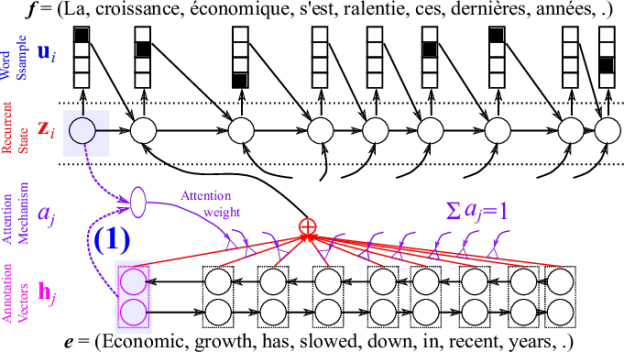
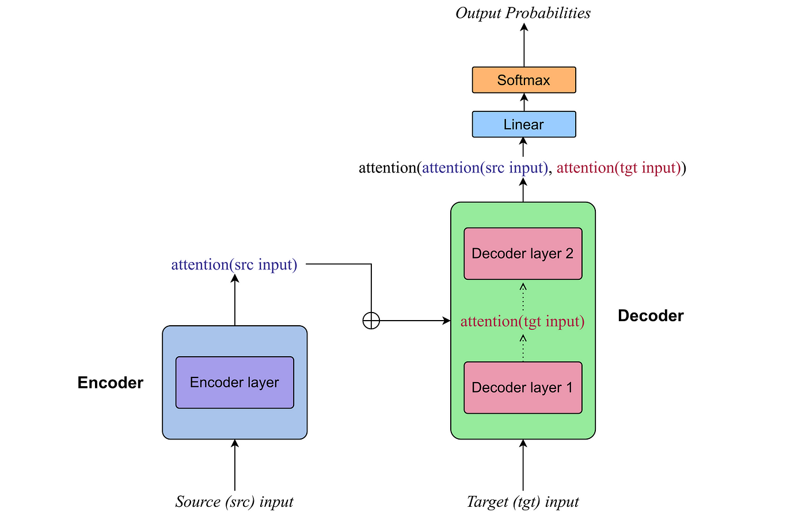
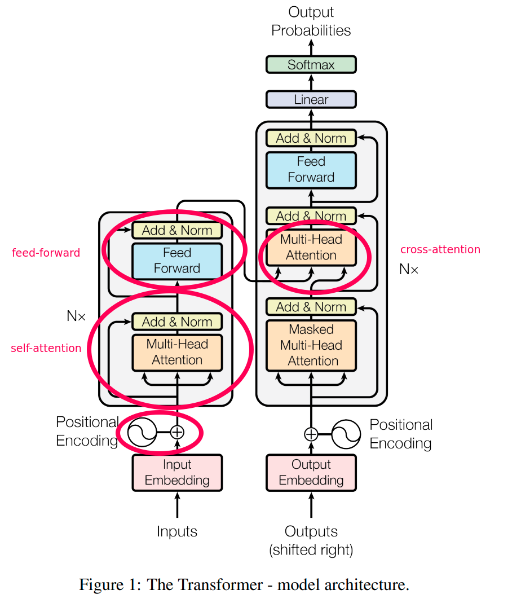

<<<<<<< HEAD
# English to Portuguese Neural Machine Translation using Transformer

This repository implements a neural machine translation (NMT) model for translating English sentences into Portuguese using the Transformer architecture. The model is trained on a parallel English-Portuguese dataset, and the code includes functionalities for training, evaluation, and real-time translation.

## Table of Contents

- [Dataset](#dataset)
- [Data Preprocessing](#data-preprocessing)
- [Model Architecture](#model-architecture)
- [Training](#training)
- [Training Progress Plotting](#training-progress-plotting)
- [Evaluation and Inference](#evaluation-and-inference)
- [Usage](#usage)
- [Set Up VENV and CUDA for GPU Acceleration](#setup-venv)
- [Dependencies](#dependencies)
- [License](#license)
- [Acknowledgments](#acknowledgments)



## [Dataset](#dataset)

- The translation model is trained on a parallel English-Portuguese dataset.
- The dataset used for training the translation model is stored in the file `por.txt`.

## [Data Preprocessing](#data-preprocessing)

The translation data is preprocessed to prepare it for training. This includes shuffling, limiting the dataset size, and adding special tokens for Transformer input.

- **Loading and Preprocessing**
  - The dataset is loaded and processed using Pandas for efficient data manipulation and TorchText for natural language processing tasks.

- **Additional Context for Transformer**
  - Extra context is added to the Portuguese sentences to facilitate the transformer model's understanding.
  - This is achieved by appending `<SOS>` (Start of Sentence) at the beginning and `<EOS>` (End of Sentence) at the end of each Portuguese sentence:

- **Tokenization**
  - Both English and Portuguese sentences are tokenized using `SpaCy`, and `TorchText` for efficient processing.

- **Custom Dataset Handling**
  - A custom dataset class (`MyDataset`) is designed to manage training and validation datasets efficiently.
  - This class streamlines data loading and ensures compatibility with the training loop.

- **Dataset Splitting**
  - The dataset is split into training and validation sets using the `train_test_split` function.
  - This ensures that the model is trained on one subset of the data and evaluated on another, facilitating the assessment of its generalization performance.





## [Model Architecture](#model-architecture)

The neural machine translation model is based on the Transformer architecture.

### Transformer Model

The neural machine translation model is built upon a custom Transformer architecture, comprising the following key components:

- **Multi-Head Attention Layer**
  - Incorporates multiple attention heads to simultaneously capture different aspects of the input sequence.
  - Applies linear transformations for query, key, and value vectors.

- **Position-wise Feedforward Layer**
  - Utilizes two linear transformations with a ReLU activation in between.
  - Enhances the model's ability to capture non-linear relationships in the data.

- **Positional Encoding**
  - Incorporates positional encoding to provide the model with information about the order of words in a sequence.
  - Utilizes sine and cosine functions for positional encoding.

- **Encoder and Decoder Layers**
  - The model is composed of multiple encoder and decoder layers.
  - Encoder layers consist of self-attention and feedforward components.
  - Decoder layers include self-attention, cross-attention, and feedforward components.


## [Training](#training)

The training loop is implemented to train the Transformer model on the English-Portuguese translation dataset. The training progress, including average loss, accuracy, and learning rate, is saved.

### Training Configuration and Optimization

The configuration and optimization of the neural machine translation model involve the following components:

- **Hyperparameters**
  - Specifies hyperparameters such as the model dimension (`d_model`), number of heads (`num_heads`), feedforward dimension (`d_ff`), and dropout rate for model initialization.

- **Optimizer and Scheduler**
  - Utilizes the Adam optimizer for gradient-based optimization.
  - Learning rate scheduling is facilitated using the ReduceLROnPlateau scheduler for effective convergence.

- **Gradient Scaling**
  - Implements gradient scaling with the GradScaler to enhance training stability.
  - Mitigates potential issues related to vanishing or exploding gradients.

- **Gradient Norm Clipping**
  - The gradient norm is clipped to prevent exploding gradients during backpropagation.

- **Custom Dataset Handling**
  - Designs a custom dataset class (`MyDataset`) to manage training and validation datasets efficiently.

- **Dataloader**
  - Utilizes DataLoader to efficiently load batches of data during training.

- **Training Loop and Checkpoints**
  - Checkpoints and training progress are saved during training.
  - Enables the resumption of training from the last checkpoint, allowing for experimentation without restarting from scratch.

- **Early Stopping**
  - Validation metrics are monitored, and training may be halted early if the model's performance on the validation set does not improve, preventing overfitting.

## [Training Progress Plotting](#training-progress-plotting)

A function is provided to plot the training progress, displaying training and validation loss as well as accuracy over epochs.

### Plotting Training Progress

- The `plot_training_progress` function is used to visualize the training progress.
- Two subplots are created to show the training and validation loss over epochs in one plot and training and validation accuracy in another.
- The plots provide a comprehensive overview of the model's learning curve and performance.

## [Evaluation and Inference](#evaluation-and-inference)

The trained model is loaded from a checkpoint, and translations are generated for sample sentences. Additionally, the user can input English sentences for real-time translation.

- **Translating Sample Sentences**
  - Translations are generated for sample sentences to assess the model's performance

- **User Input Translation**
  - Users can input English sentences for real-time translation using the trained model.

## [Usage](#usage)

Clone the repository and follow the instructions in the code comments to set up and train the English to Portuguese translation model.

- Use the following command to clone the repository to your local machine:
   ```bash
   git clone https://github.com/joshuapramirez/GPT-Translator-Model

## [Set Up VENV and CUDA for GPU Acceleration](#setup-venv)

If you have a compatible NVIDIA GPU, you can leverage CUDA for faster training and inference on the neural machine translation model. Follow the steps below to set up CUDA:

### 1. Install the Appropriate NVIDIA Driver

Ensure you have the latest NVIDIA GPU drivers installed on your system. You can download the drivers from the [official NVIDIA website](https://www.nvidia.com/Download/index.aspx).

### 2. Install CUDA Toolkit

Download and install the CUDA Toolkit compatible with your GPU from the [NVIDIA CUDA Toolkit Download Page](https://developer.nvidia.com/cuda-downloads).

### 3. Install cuDNN

Download and install the cuDNN library from the [NVIDIA cuDNN Download Page](https://developer.nvidia.com/cudnn). Make sure to select the version compatible with your CUDA Toolkit.

### 4. Verify CUDA Installation

After installation, verify that CUDA is set up correctly by running the following command in your terminal:

- ```bash
- nvcc --version

### 5. Set up VENV and CUDA

Follow the steps below to set up and activate a virtual environment for your CUDA-compatible translation model:

- ```bash

- cd `GPT-Translation-Model`

- python -m venv cuda

- cuda\Scripts\Activate   OR    source cuda/bin/activate

- pip install ipykernel

- pip3 install torch torchvision torchaudio --index-url https://download.pytorch.org/whl/cu118

- python -m ipykernel install --user --name=cuda --display-name "cuda-translator"

in jupyter notebook switch the kernel to `cuda-translator`

### 6. Verify GPU Availability

Follow the steps below to verify GPU/Cuda Availability:

- ```bash

- import torch
- print(torch.cuda.is_available())

If the output is True, your GPU is successfully configured for PyTorch.

## [Dependencies](#dependencies)

Install all of the required libraries:

- ```bash
- pip install -r requirements.txt

## [License](#license)

This project is licensed under the MIT License - see the LICENSE file for details.

## [Acknowledgments](#acknowledgments)

Inspired by the Transformer model introduced in "Attention is All You Need" by Vaswani et al.
=======
# English to Portuguese Neural Machine Translation using Transformer

This repository implements a neural machine translation (NMT) model for translating English sentences into Portuguese using the Transformer architecture. The model is trained on a parallel English-Portuguese dataset, and the code includes functionalities for training, evaluation, and real-time translation.

## Table of Contents

- [Dataset](#dataset)
- [Data Preprocessing](#data-preprocessing)
- [Model Architecture](#model-architecture)
- [Training](#training)
- [Training Progress Plotting](#training-progress-plotting)
- [Evaluation and Inference](#evaluation-and-inference)
- [Usage](#usage)
- [Set Up VENV and CUDA for GPU Acceleration](#setup-venv)
- [Dependencies](#dependencies)
- [License](#license)
- [Acknowledgments](#acknowledgments)


## [Dataset](#dataset)

- The translation model is trained on a parallel English-Portuguese dataset.
- The dataset used for training the translation model is stored in the file `por.txt`.

## [Data Preprocessing](#data-preprocessing)

The translation data is preprocessed to prepare it for training. This includes shuffling, limiting the dataset size, and adding special tokens for Transformer input.

- **Loading and Preprocessing**
  - The dataset is loaded and processed using Pandas for efficient data manipulation and TorchText for natural language processing tasks.

- **Additional Context for Transformer**
  - Extra context is added to the Portuguese sentences to facilitate the transformer model's understanding.
  - This is achieved by appending `<SOS>` (Start of Sentence) at the beginning and `<EOS>` (End of Sentence) at the end of each Portuguese sentence:

- **Tokenization**
  - Both English and Portuguese sentences are tokenized using `SpaCy`, and `TorchText` for efficient processing.

- **Custom Dataset Handling**
  - A custom dataset class (`MyDataset`) is designed to manage training and validation datasets efficiently.
  - This class streamlines data loading and ensures compatibility with the training loop.

- **Dataset Splitting**
  - The dataset is split into training and validation sets using the `train_test_split` function.
  - This ensures that the model is trained on one subset of the data and evaluated on another, facilitating the assessment of its generalization performance.


## [Model Architecture](#model-architecture)

The neural machine translation model is based on the Transformer architecture.

### Transformer Model

The neural machine translation model is built upon a custom Transformer architecture, comprising the following key components:

- **Multi-Head Attention Layer**
  - Incorporates multiple attention heads to simultaneously capture different aspects of the input sequence.
  - Applies linear transformations for query, key, and value vectors.

- **Position-wise Feedforward Layer**
  - Utilizes two linear transformations with a ReLU activation in between.
  - Enhances the model's ability to capture non-linear relationships in the data.

- **Positional Encoding**
  - Incorporates positional encoding to provide the model with information about the order of words in a sequence.
  - Utilizes sine and cosine functions for positional encoding.

- **Encoder and Decoder Layers**
  - The model is composed of multiple encoder and decoder layers.
  - Encoder layers consist of self-attention and feedforward components.
  - Decoder layers include self-attention, cross-attention, and feedforward components.


## [Training](#training)

The training loop is implemented to train the Transformer model on the English-Portuguese translation dataset. The training progress, including average loss, accuracy, and learning rate, is saved.

### Training Configuration and Optimization

The configuration and optimization of the neural machine translation model involve the following components:

- **Hyperparameters**
  - Specifies hyperparameters such as the model dimension (`d_model`), number of heads (`num_heads`), feedforward dimension (`d_ff`), and dropout rate for model initialization.

- **Optimizer and Scheduler**
  - Utilizes the Adam optimizer for gradient-based optimization.
  - Learning rate scheduling is facilitated using the ReduceLROnPlateau scheduler for effective convergence.

- **Gradient Scaling**
  - Implements gradient scaling with the GradScaler to enhance training stability.
  - Mitigates potential issues related to vanishing or exploding gradients.

- **Gradient Norm Clipping**
  - The gradient norm is clipped to prevent exploding gradients during backpropagation.

- **Custom Dataset Handling**
  - Designs a custom dataset class (`MyDataset`) to manage training and validation datasets efficiently.

- **Dataloader**
  - Utilizes DataLoader to efficiently load batches of data during training.

- **Training Loop and Checkpoints**
  - Checkpoints and training progress are saved during training.
  - Enables the resumption of training from the last checkpoint, allowing for experimentation without restarting from scratch.

- **Early Stopping**
  - Validation metrics are monitored, and training may be halted early if the model's performance on the validation set does not improve, preventing overfitting.


## [Training Progress Plotting](#training-progress-plotting)

A function is provided to plot the training progress, displaying training and validation loss as well as accuracy over epochs.

### Plotting Training Progress

- The `plot_training_progress` function is used to visualize the training progress.
- Two subplots are created to show the training and validation loss over epochs in one plot and training and validation accuracy in another.
- The plots provide a comprehensive overview of the model's learning curve and performance.

## [Evaluation and Inference](#evaluation-and-inference)

The trained model is loaded from a checkpoint, and translations are generated for sample sentences. Additionally, the user can input English sentences for real-time translation.

- **Translating Sample Sentences**
  - Translations are generated for sample sentences to assess the model's performance

- **User Input Translation**
  - Users can input English sentences for real-time translation using the trained model.


## [Usage](#usage)

Clone the repository and follow the instructions in the code comments to set up and train the English to Portuguese translation model.

- Use the following command to clone the repository to your local machine:
   ```bash
   git clone https://github.com/joshuapramirez/GPT-Translator-Model

## [Set Up VENV and CUDA for GPU Acceleration](#setup-venv)

If you have a compatible NVIDIA GPU, you can leverage CUDA for faster training and inference on the neural machine translation model. Follow the steps below to set up CUDA:

### 1. Install the Appropriate NVIDIA Driver

Ensure you have the latest NVIDIA GPU drivers installed on your system. You can download the drivers from the [official NVIDIA website](https://www.nvidia.com/Download/index.aspx).

### 2. Install CUDA Toolkit

Download and install the CUDA Toolkit compatible with your GPU from the [NVIDIA CUDA Toolkit Download Page](https://developer.nvidia.com/cuda-downloads).

### 3. Install cuDNN

Download and install the cuDNN library from the [NVIDIA cuDNN Download Page](https://developer.nvidia.com/cudnn). Make sure to select the version compatible with your CUDA Toolkit.

### 4. Verify CUDA Installation

After installation, verify that CUDA is set up correctly by running the following command in your terminal:

```bash
- nvcc --version

### 5. Set up VENV and CUDA

Follow the steps below to set up and activate a virtual environment for your CUDA-compatible translation model.

```bash

- cd `GPT-Translation-Model`

- python -m venv cuda

- cuda\Scripts\Activate   OR    source cuda/bin/activate

- pip install ipykernel

- pip3 install torch torchvision torchaudio --index-url https://download.pytorch.org/whl/cu118

- python -m ipykernel install --user --name=cuda --display-name "cuda-translator"

in jupyter notebook switch the kernel to `cuda translator`

### 6. Verify GPU Availability

```bash

- import torch
- print(torch.cuda.is_available())

If the output is True, your GPU is successfully configured for PyTorch.

## [Dependencies](#dependencies)

pip install -r requirements.txt

## [License](#license)

This project is licensed under the MIT License - see the LICENSE file for details.

## [Acknowledgments](#acknowledgments)

Inspired by the Transformer model introduced in "Attention is All You Need" by Vaswani et al.
>>>>>>> f1f2c019569079af85fd418d2bc30fbc8afcd668
Thanks to the PyTorch and TorchText communities for their excellent libraries.